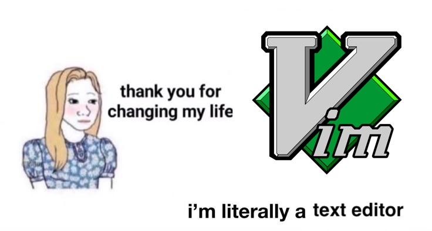
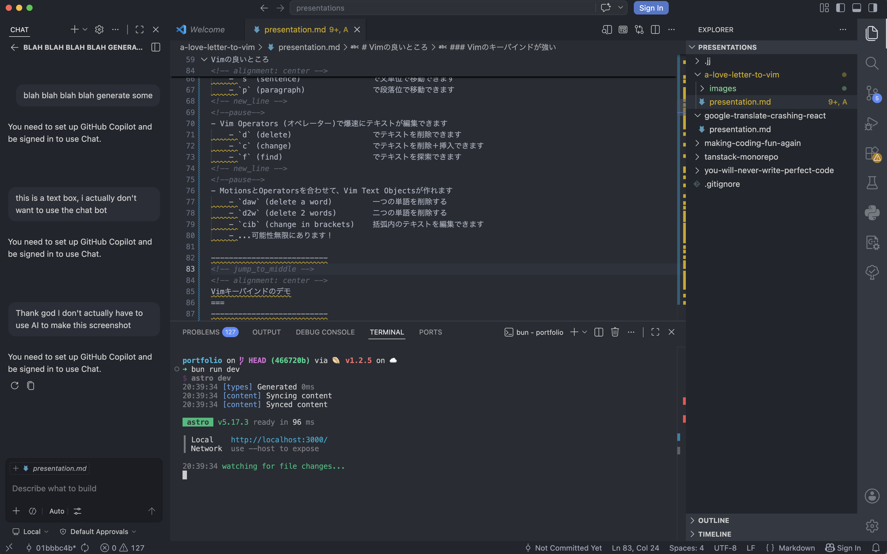
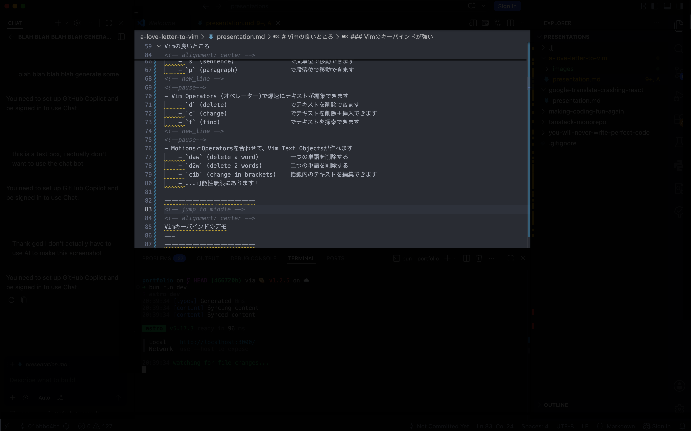
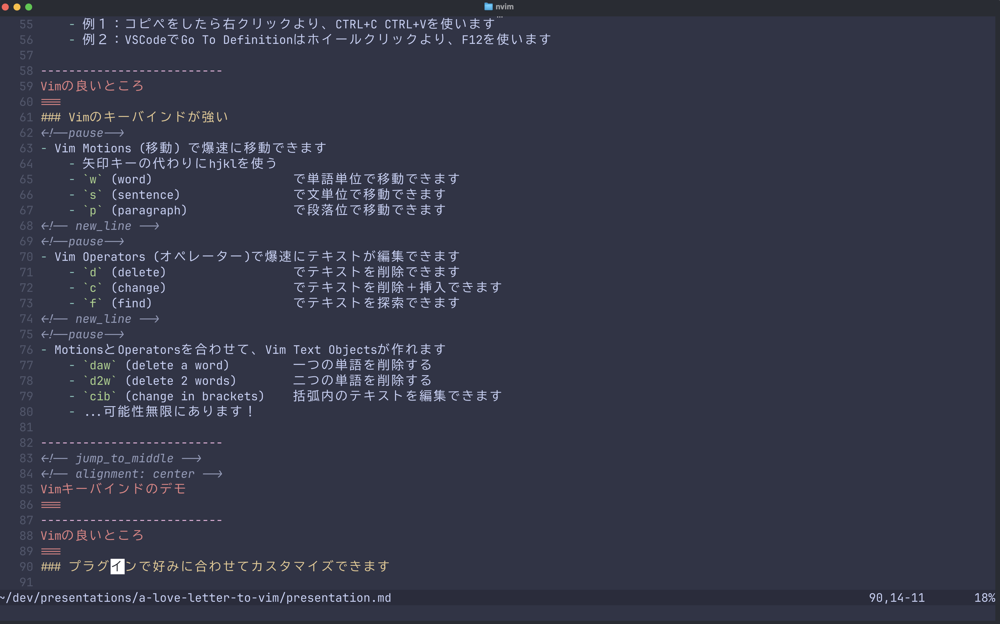

<!-- alignment: center -->
<!-- font_size: 7 -->
愛人
===
<!-- speaker_note: 
今日、みんなさんに愛話をしたいです。僕は恋人います。
僕にとって、大切な存在です。
-->
<!-- font_size: 1 -->
<!--pause-->
その方と毎日数時間楽しんで話しています
<!--pause-->
その方のこと時々理解できず、喧嘩になることがあります
<!--pause-->
その方は今年34歳です
<!--pause-->
<!-- font_size: 2 -->
そうです、その方は...

-------------------------
<!-- alignment: center -->
<!-- jump_to_middle -->
<!-- font_size: 4 -->
Vimです
===
<!-- speaker_note: 
Vimです。Vimを愛しています。
-->
-------------------------
Vimとは？
===
<!--pause-->
Vimはターミナルで動作するテキストエディタです。 それ以上でもそれ以下でもありません。

<!--pause-->
Vimの前に、Vi (Visual Interface)というプログラムがありました。Vimは単にVi IMproved.

--------------------------
Vimの良いところ
===
### 1. 主にキーボードでVimを使う
<!--pause-->
- マウスより、キーボードが早いです。それは事実です。
    - 例１：コピペをしたら右クリックより、CTRL+C CTRL+Vを使います
    - 例２：VSCodeでGo To Definitionはホイールクリックより、F12を使います

--------------------------
Vimの良いところ
===
### 2 Vimのキーバインドが強い
<!--pause-->
- Vim Motions (移動) で爆速に移動できます
    - 矢印キーの代わりにhjklを使う
    - `w` (word)                    で単語単位で移動できます
    - `s` (sentence)                で文単位で移動できます
    - `p` (paragraph)               で段落位で移動できます
<!-- new_line -->
<!--pause-->
- Vim Operators (オペレーター)で爆速にテキストが編集できます
    - `d` (delete)                  でテキストを削除できます
    - `c` (change)                  でテキストを削除＋挿入できます
    - `f` (find)                    でテキストを探索できます
<!-- new_line -->
<!--pause-->
- MotionsとOperatorsを合わせて、Vim Text Objectsが作れます
    - `daw` (delete a word)         一つの単語を削除する
    - `d2w` (delete 2 words)        二つの単語を削除する
    - `cib` (change in brackets)    括弧内のテキストを編集できます
    - ...可能性無限にあります！

--------------------------
<!-- jump_to_middle -->
<!-- alignment: center -->
Vimキーバインドのデモ
===
--------------------------
Vimの良いところ
===
### 3. プラグインで好みに合わせてカスタマイズできます
- Vimはシムプルですが、プラグインで様々な機能が付けられます
- 僕はnvim (Neovim)を使用して、できるだけ少ないプラグインを使います

--------------------------
VSCodeの例
===
VSCodeは普通にこのように見えます

--------------------------
VSCodeの例
===
情報が多すぎ！そして、コードの部分が狭いと思いませんか？

--------------------------
僕のnvim
===
スペースは大切にしています。コードしか見たくないです。

--------------------------
<!-- jump_to_middle -->
<!-- alignment: center -->
理想の開発環境が作れます
===

--------------------------
Vimの悪いところ
===
### 1. プラグインの維持はめんどくさい！
<!--pause-->
- 本当にそう。さらに、時間がかかります
<!--pause-->
- 追加すればするほど、何かが壊れる可能性が高くなります
<!--pause-->
- エディタが壊れたら、仕事ができません

--------------------------
Vimの悪いところ
===
### 2. Vimは使いにくい！
<!--pause-->
- 今までのテキストの書き方はゼーロから学び直す必要があります
<!--pause-->
- 最初の6ヶ月間にvimを全然使えませんでした。ZedとVim Motionsで開発しました
<!--pause-->
- 時間の無駄だと思って、何度も諦めようと思いました

--------------------------
<!-- jump_to_middle -->
<!-- alignment: center -->
それでも、vimが好きだ
===

--------------------------
<!-- jump_to_middle -->
<!-- alignment: center -->
なぜ？
===

--------------------------
<!-- jump_to_middle -->
<!-- alignment: center -->
<!-- font_size: 1 -->
愛とは、相手の欠点をすべて見ても、好きになることだから
===

--------------------------
<!-- alignment: center -->
最後に...
===
<!--pause-->
もし、自分の開発環境をカスタマイズしたいなら...

<!--pause-->
もし、キーボードだけの生活を送りたいなら...

<!--pause-->
もし、プログラミングに新たな喜びを見出したいなら...

--------------------------
<!-- jump_to_middle -->
<!-- alignment: center -->
vimを使ってみて欲しい！
===

--------------------------
<!-- alignment: center -->
新しい出会いもできるし！
===

