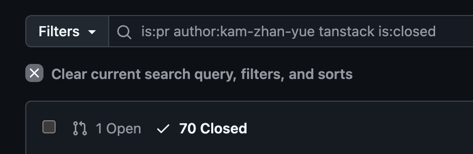
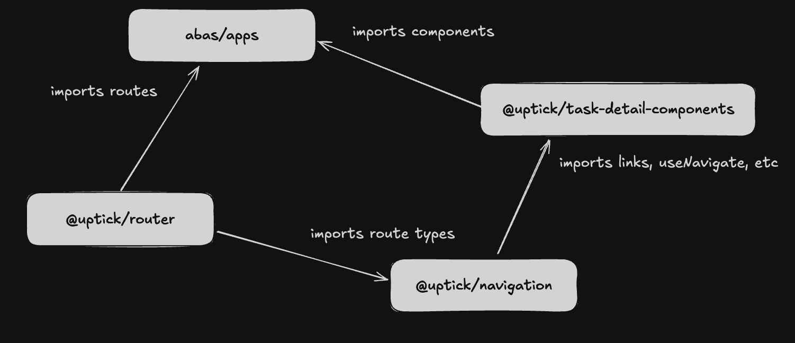
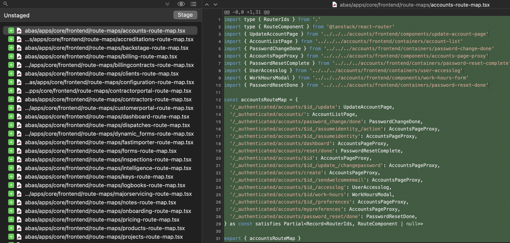
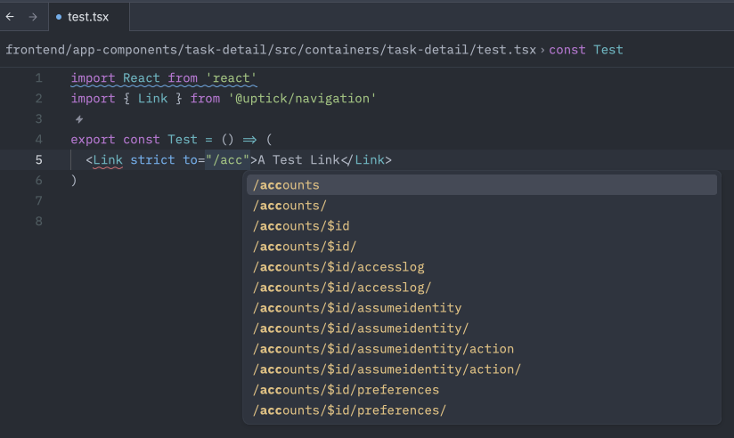

A Review
===
To refresh everyone's memories on the Tanstack progress, this was our timeline.

- ✅ Phase 1: Refactor Routes (July)
- ✅ Phase 2: Navigation Package (August)
- ✅ Phase 3: Route Migration (September)
- ✅ Phase 4: Remove React Router (October)
- ❌ Phase 5: Type Safety (November)

Considering the planning and researching phase started in March, it's been around 6 months and ~70 PRs of this.


<!-- end_slide -->
A Review
===


<!-- alignment: center -->
_It was not that simple._


<!-- end_slide -->

<!-- jump_to_middle -->

1 - The Workings
===
<!-- alignment: center -->
_How does Tanstack achieve typesafety?_

<!-- end_slide -->

How does Tanstack achieve type safety?
==

All Tanstack types are derived from a generated file called `routeTree.gen.ts`. This scans through our route folder and generates types that we can use. The idea was to generate it, then use it all across the project. This is generated by the `mise run build:routes` command


### abas/apps/routeTree.gen.ts

```typescript +line_numbers
// 1. Imports directly from the file
import { Route as PublicLoginRouteImport } from "./routes/_public/login";
...

// 2. Generates nice Typescript types based on the imported file
const PublicLoginRoute = PublicLoginRouteImport.update({
  id: '/_public/login',
  path: '/login',
  getParentRoute: () => rootRouteImport,
} as any)
...

// 3. Exports out the generated types
export interface FileRoutesByFullPath {
  '/login': typeof PublicLoginRoute
```

<!-- end_slide -->
# Accessing Types
Then, to access these types, we declare them alongside `@tanstack/react-router`. Now, we anything that imports this package will have those types.

### abas/apps/core/frontend/app/tanstack.tsx
```typescript +line_numbers
// 1. Import the route tree and tanstack stuff
import { routeTree } from "apps/routeTree.gen";
import { createRouter } from "@tanstack/react-router";

// 2. Create a router with the route tree
const router = createRouter({ routeTree });

// 3. Put these types into `@tanstack/react-router`
declare module "@tanstack/react-router" {
  interface Register {
    router: typeof router;
  }
}
```

<!-- end_slide -->
# The Anatomy of a Route File
Now, let's look at `./routes/_public/login.tsx`.

```typescript +line_numbers
import { createFileRoute } from "@tanstack/react-router";
import { Login } from "@uptick/workforce-app";

export const Route = createFileRoute("/_public/login")({
  component: Login,
});
```

- Uses `createFileRoute` to define a route. The `/_public/login` part is autogenerated by the route tree.
- Imports `Login` from `@uptick/workforce-app`
- Links the component to `Login`

<!--end_slide -->
# Everything is Connected

This problem isn't isolated to `@uptick/workforce-app`. We have file routes that stretch into almost every single package.

### abas/apps/routes/_authenticated/properties/$id.tsx
```typescript +line_numbers {2, 5}
import { createFileRoute } from '@tanstack/react-router'
import { PropertyDetail } from '@uptick/property-detail-components'

export const Route = createFileRoute('/_authenticated/properties/$id')({
  component: PropertyDetail,
})
```


### abas/apps/routes/_authenticated/tasks/tasks/$id.tsx
```typescript +line_numbers {2, 5}
import { createFileRoute } from '@tanstack/react-router'
import { TaskDetail } from '@uptick/task-detail-components'

export const Route = createFileRoute('/_authenticated/tasks/tasks/$id')({
  component: TaskDetail,
})
```

...do you see where I'm going with this?

<!--end_slide-->
<!-- jump_to_middle -->
2 - The Problem
===
<!-- alignment: center -->
_Cyclic dependencies, cyclic dependencies everywhere_

<!--end_slide -->

# Cyclic Dependencies

Our navigation components are defined in `@uptick/navigation`. So, it makes sense to import our generated types there. Let's try to turn `<Link>` typesafe.

### frontend/general-components/navigation/src/components/link/link.tsx
```typescript +line_numbers
import { someLinkTypes } from 'apps/routeTree.gen.ts'

const Link = (props: typeof someLinkTypes) => { ... }
```

Then, let's use it somewhere else.

### frontend/app-components/task-detail/src/task-detail.tsx

```typescript +line_numbers
import { Link } from '@uptick/navigation'

const TaskDetail = () => (
    <Link to="/properties/">To properties</Link>
)
```

<!-- alignment: center -->
`@uptick/task-detail-components` -> `@uptick/navigation` -> `@uptick/task-detail-components`
<!-- alignment: left -->

1. We import `@uptick/navigation` into `@uptick/task-detail-components`
2. This imports `routeTree.gen.ts`
3. This imports `@uptick/task-detail-components` (among many other packages)

<!-- end_slide -->
<!-- jump_to_middle -->
3 - The Solution
=== 
<!--alignment: center -->
_Did someone say dependency injections?_

<!-- end_slide -->
# @uptick/router
The only way to solve this depenency nightmare is to abstract all of our route files into a dedicated package, `@uptick/router`. This will have the file structure and types ONLY.



- `@uptick/router` ONLY defines routes, no components
```typescript +line_numbers
import { createFileRoute } from '@tanstack/react-router'
export const Route = createFileRoute('/_authenticated/tasks/tasks/$id')({})
```

- `abas/apps` imports `@uptick/router` and connects the components like so:

```typescript +line_numbers
import { TaskDetail, TaskGeoallocator } from '@uptick/task-detail-components'

const tasksRouteMap = {
  '/_authenticated/tasks': null,
  '/_authenticated/tasks/tasks/geoallocator': TasksGeoallocator,
  '/_authenticated/tasks/tasks/bulk/consolidate': TasksBulkConsolidate,
  '/_authenticated/tasks/tasks/$id': TaskDetail,
}

router.update({ tasksRouteMap })
```
- `@uptick/navigation` imports route types from `@uptick/router` to make typesafe `Link`s
- Packages like `@uptick/task-detail-components` can safely use `@uptick/navigation`

<!-- end_slide-->
# Refactoring
In order to achieve this, we need to solve the following situation:
### abas/apps/routes/_authenticated/accounts/$id_update.tsx
```typescript +line_numbers
import { createFileRoute } from '@tanstack-router'
import { AccessDenied } from '@uptick/workforce-app'
import { UpdateAccountPage } from '@uptick/accounts-components'

export const Route = createFileRoute('/_authenticated/accounts/$id_/update')({
  component: RouteComponent,
})

function RouteComponent() {
  const { auth } = Route.useRouteContext()
  if (!auth.hasLicense('DESK'))
    return <AccessDenied missingLicenses={['DESK']} />

  return <UpdateAccountPage />
}
```
We have a simple route file that does authentication checks and returns a component from an external package when the checks pass.


<!-- end_slide-->
# Refactoring
### abas/apps/routes/_authenticated/accounts/$id_update.tsx
```typescript +line_numbers {2, 3}
import { createFileRoute } from '@tanstack-router'
import { AccessDenied } from '@uptick/workforce-app'
import { UpdateAccountPage } from '@uptick/accounts-components'

export const Route = createFileRoute('/_authenticated/accounts/$id_/update')({
  component: RouteComponent,
})

function RouteComponent() {
  const { auth } = Route.useRouteContext()
  if (!auth.hasLicense('DESK'))
    return <AccessDenied missingLicenses={['DESK']} />

  return <UpdateAccountPage />
}
```
The crux of the problem is getting rid of these two imports. If we don't get rid of these, we can't put it into a route map so easily.


<!-- end_slide-->
# Refactoring - Authentication
Let's solve the first import.
### abas/apps/routes/_authenticated/accounts/$id_update.tsx
```typescript +line_numbers {2, 10, 11, 12}
import { createFileRoute } from '@tanstack-router'
import { AccessDenied } from '@uptick/workforce-app'
import { UpdateAccountPage } from '@uptick/accounts-components'

export const Route = createFileRoute('/_authenticated/accounts/$id_/update')({
  component: RouteComponent,
})

function RouteComponent() {
  const { auth } = Route.useRouteContext()
  if (!auth.hasLicense('DESK'))
    return <AccessDenied missingLicenses={['DESK']} />

  return <UpdateAccountPage />
}
```
The above cannot be put into a route map so easily, because it uses a `RouteComponent` functional component to wrap our authentication logic. This is our authentication pattern and have around ~140 instances of theses.

<!-- end_slide-->
# Refactoring - Authentication
Let's throw errors instead!

### abas/apps/routes/_authenticated/accounts/$id_update.tsx
```typescript +line_numbers {5, 6, 7}
import { createFileRoute } from '@tanstack-router'
import { UpdateAccountPage } from '@uptick/accounts-components'

export const Route = createFileRoute('/_authenticated/accounts/$id_/update')({
  beforeLoad: ({ context: { auth } }) => {
    auth.assertHasLicense('DESK')
  },
  component: UpdateAccountPage,
})
```
Instead of returning JSX here, we can instead use Tanstack's `notFound` errors and throw them in loader functions. These loader functions are executed BEFORE the component is rendered.

### frontend/router/src/context/auth.tsx
```typescript +line_numbers {3, 4}
  const assertLicense = useCallback(
    (license: License) => {
      if (!hasLicense(license))
        throw notFoundError({ reason: 'license', missingLicenses: [license] })
    },
    [hasLicense]
  )
```

<!-- end_slide-->
# Refactoring - Authentication
Then, we can map these errors to specific components.
### abas/apps/core/frontend/app/not-found.tsx
```typescript +line_numbers
const NotFound = ({ data }: Props) => {
  const notFoundData = data.data as NotFoundData
  if (notFoundData.reason === 'license') {
    return <AccessDenied missingLicenses={notFoundData.missingLicenses} />
  }
  if (notFoundData.reason === 'permission') {
    return <AccessDenied missingPermissions={notFoundData.missingPermissions} />
  }
  if (notFoundData.reason === 'extension') {
    return <ExtensionMissing extension={notFoundData.missingExtension} />
  }
  return <NotFoundPage />
```

<!-- end_slide -->
# Refactoring - Route Maps
Now, we need to solve this problem. The route file can't have external imports.
### routes/_authenticated/accounts/$id.update.tsx
```typescript +line_numbers {2, 8}
import { createFileRoute } from '@tanstack/react-router'
import { UpdateAccountPage } from '@uptick/account-components'

export const Route = createFileRoute('/_authenticated/accounts/$id_/update')({
  beforeLoad: ({ context: { auth } }) => {
    auth.assertHasLicense('DESK')
  },
  component: UpdateAccountPage,
})
```

<!-- end_slide -->
# Refactoring - Route Maps
The solution is to link the components in `abas/apps`, which imports everything.
- We define a route map for each route tree that links a `Route <-> Component` pair
- We update all the routes with their specific components, like a depedency injection

### abas/apps/core/frontend/route-maps/index.tsx
```typescript +line_numbers {2, 3, 6, 7, 8, 13, 14, 15, 16}
// 1. Import from component packages and router package
import { UpdateAccountPage } from '@uptick/account-components'
import type { RouteComponent, Router, RouteIds, routeTree } from '@uptick/router'

// 2. Define the route map
const routeMap = {
  "/_authenticated/accounts/$id": UpdateAccountPage
} as const satisfies Record<RouterIds, RouteComponent>

// 3. Define a wrapper function to inject the components in the router
const wrapRouter = (router: Router) => {
  Object.entries(routeMap).forEach(([path, component]) => {
    const foundRoute = router.routesById[path as RouterIds]
    foundRoute.update({
      component: component,
    })
  })
  return router
}

```

<!-- end_slide -->
# Refactoring - Route Maps
This let's us remove the component from the route file!
### routes/_authenticated/accounts/$id.update.tsx
```typescript +line_numbers
import { createFileRoute } from '@tanstack/react-router'

export const Route = createFileRoute('/_authenticated/accounts/$id_/update')({
  beforeLoad: ({ context: { auth } }) => {
    auth.assertHasLicense('DESK')
  },
})
```

<!-- end_slide -->
# Refactoring - Route Maps
But we need a way to reliably do this. So... I made a codemod

```shell
➜ generate-routes --strip
=======ADDITIONS=======
Made 718 additions
=======REMOVALS=======
Made 718 removals
```




<!-- end_slide -->
<!-- jump_to_middle -->
The Future
===
<!-- alignment: center -->
_Do you hear the bells?_

<!-- end_slide -->
# Type Safety
Now we can safely import `@uptick/router` in `@uptick/navigation` to do this.

```typescript +line_numbers
// 1. Import from @uptick/router
import { Link as TanstackLink, type LinkProps as TanstackLinkProps } from '@uptick/router'
import type { LinkProps as ReactRouterLinkProps } from '../../react-router-types'

// 2. Use discriminated unions to choose between types
type StrictLinksProps = {
  strict: true
} & TanstackLinkProps

type LooseLinkProps = {
  strict?: false
  to: string
  state?: Record<string, string | boolean>
} & Omit<ReactRouterLinkProps, 'to'>

type LinkProps = LooseLinkProps | StrictLinksProps

// 3. Implement the component
const Link = ({ to, state, strict, ...props }: LinkProps) => {

```

<!-- end_slide -->
# Type Safety
And we can combine having loose and strict typing, all in one.

### @uptick/task-detail-components





<!-- end_slide -->
# Next Steps
Once all this is merged, we need to implement strict typing across our codebase.
- Type safe `Link` and `NavLink`
- Type safe `useNavigate`
- Type safe `useParams`
- Type safe `useSearchParams`


But also, we need to update our docs.
- Confluence page on our tanstack monorepo configuration
- Confluence page on implementign type safety

And we need to improve our `mise run build:routes` command
- Automated creation of the file in the route map
- Automated documentation of our routes

Still a long way to go 😓

<!-- end_slide -->
<!-- jump_to_middle -->
The End
==
