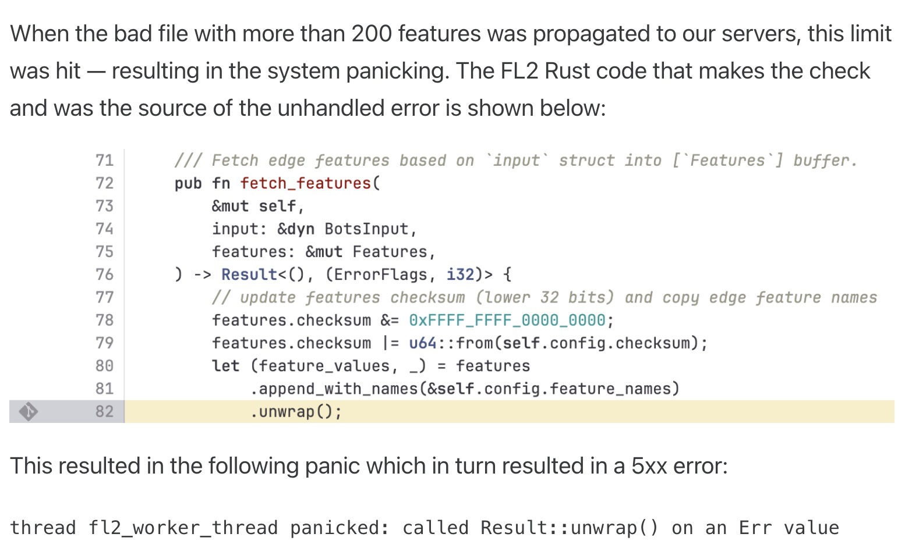
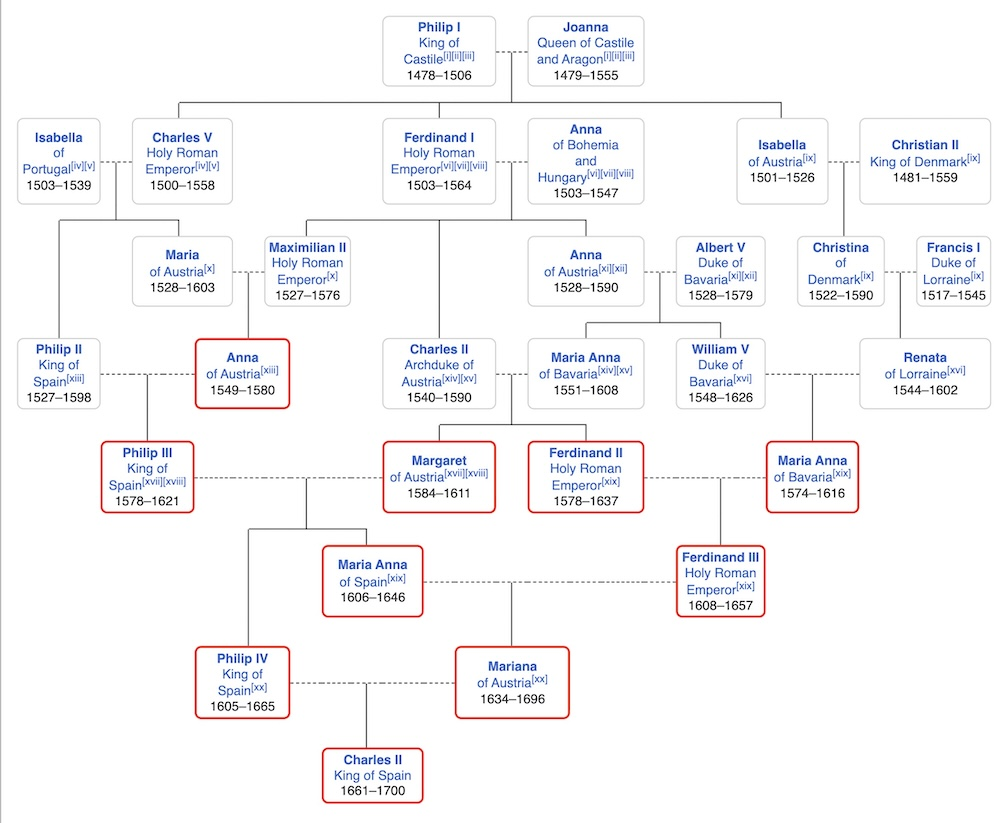
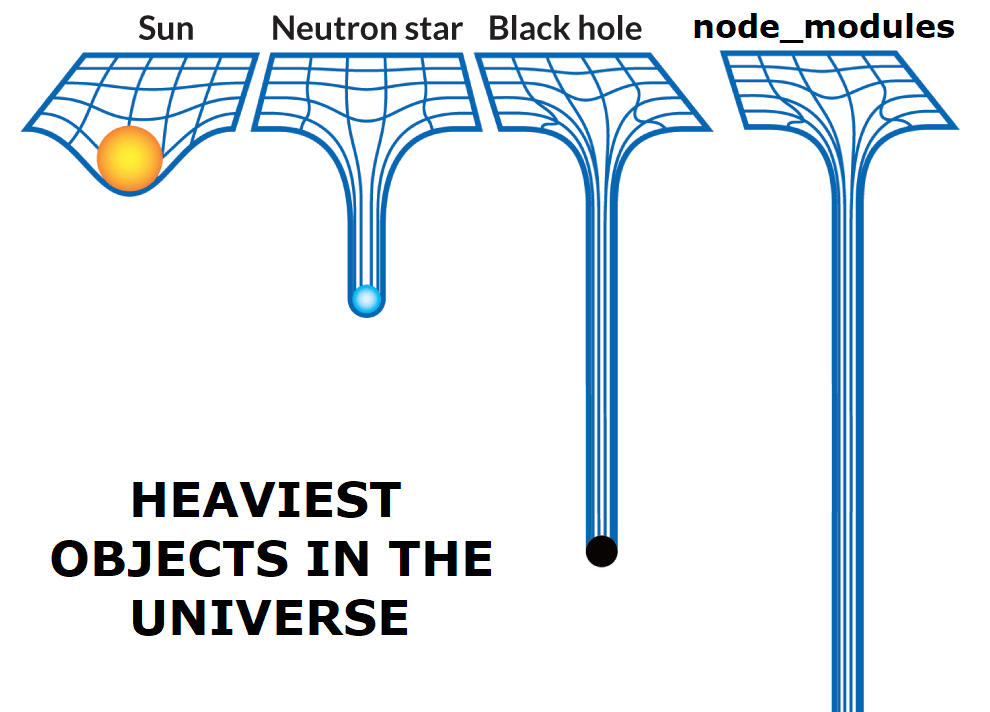
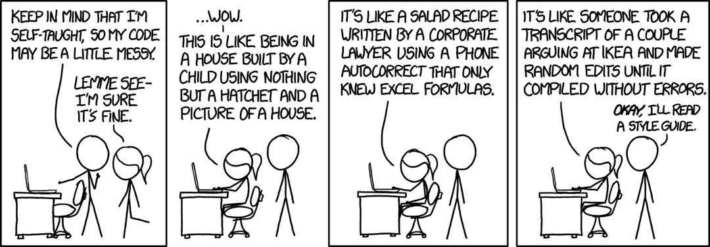
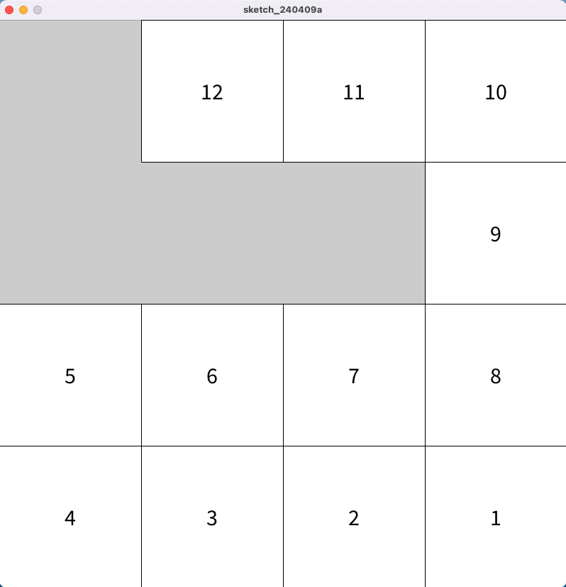

Writing Perfect Code
===
As software developers, we constantly wonder whether the code we write is good. I mean, that is our jobs, right? 

<!--pause-->

## Writing code is simple
It just has to be:

<!--pause-->
- <span style="color: green">Completely optimised</span> without any memory leaks
<!--pause-->
- <span style="color: green">Perfectly readable</span> so that anyone can maintain it
<!--pause-->
- Have <span style="color: green">absolutely no bugs</span> nor regressions.
<!--pause-->
- Adhere to <span style="color: green">all engineering practices</span> that's covered in the team's documentation
<!--pause-->
- Have <span style="color: green">comprehensive tests</span> for all possible code paths
<!--pause-->
- Oh and just <span style="color: red">keep it simple, stupid!</span>

<!--pause-->

## It's Hard
Of course, these are completely unreasonable expectations to hold over any developer. 

There are a million factors involved with writing code: deadlines, engineering culture, existing tech debt, and so on.

It is never just about the developer and their code.

--------------------------

Ever-Changing Landscape
===
By most people's standards, I'm a fairly new developer. However, I feel like everything I learned is constantly being
challenged and rendered as outdated by newer and modern technologies and takes from web and game development.

<!--pause-->
> jQuery was the worst thing to ever be created.
<!--pause-->
> React is amazing! We can make super interactive UIs now!
<!--pause-->
> Client-side rendering is dead. Long live SSR.
<!--pause-->
> Hooks? What was wrong with the class based approach?
<!--pause-->
> SSR was a mistake, what a security nightmare!
<!--pause-->
> Functional programming is the future. Let's make everything a hook!
<!--pause-->
> Javascript? Cringe. HTMX is the future.
<!--pause-->
> jQuery was actually the best thing ever.
<!--pause-->

Trends come and go in software development (especially in frontend web dev). And even though there are many people who
have been coding longer than I have been alive, I feel like I've heard it all already. 

So that begs the question...

--------------------------

<!-- jump_to_middle -->
<!-- alignment: center -->
How can I write 'perfect' code if what is 'perfect' change every few months?
===
---------------------------

Just Rewrite it in Rust
===
<!-- alignment: center -->
The age-old addage. Why even bother writing anything in any other language if Rust is already the gold standard?

It has a borrow checker, all your code is memory safe! 

The syntax makes you write better code!

Clippy teaches you the best practices!

Anything rewritten in Rust is going to be safe!

---------------------------


--------------------------


--------------------------



--------------------------

Rust is not 'perfect'
===

Rust is a great language, but it is not a silver bullet.

- Developers can simply call `unwrap()` instead of properly handling errors
- `.clone()` can be overused to bypass strict immutability checks
- `Arc<Mutex<T>>` makes it too easy to make anything accessible on shared threads, but locks performance

Rust has its own share of footguns and ways to take the 'easy way out'.

Hence, I worry about the quality of anything 'rewritten in Rust'.


--------------------------

Just Rewrite... it?
===
If you can't (or shouldn't) rewrite in Rust, maybe we should just refactor it? 

I mean just look at this poor component!

```typescript
// @ts-expect-error  @FIXME  ts(6133) 'prevProps' is declared but its value is never read.
componentDidUpdate(prevProps, prevState) {
    // manually fire off a change event for the hidden input
    // @ts-expect-error  @FIXME  ts(2339) Property 'value' does not exist on type 'Readonly...
    if (prevState.value !== this.state.value) {
      // for IE support xD
      const event = document.createEvent('Event')
      event.initEvent('change', true, true)
      // @ts-expect-error  @FIXME  ts(2339) Property 'inputRef' does not exist on type 'ReactDj..
      this.inputRef.current.dispatchEvent(event)
    }
}
```

Yes, it's due for an uplift anyways. I mean just look at it! Class-based React components scattered with `@ts-expect-errors`.
A cheeky hack for Internet Explorer? And this has to cause some sort of infinite render loop stuck between all these `componentDidUpdate` and `dispatchEvent` functions.

<!--pause-->

... what do you mean this is already the <span style="color: red">_**third iteration of this component**_</span>?


---------------------------
Code is Transient
===


Code that has been written will be rewritten with new standards.

Code that you write now will be deemed outdated and legacy in a few years.

Code that will replace your code will be laughed at by developers in ten year's time for being unoptimised and a representation of the pinnacle of poor practices.

<!--pause-->
Fuck it, do we just write everything in C?

I guess what I'm trying to say is ...


---------------------------

Perfect Code Doesn't Exist
===

<!--pause-->
> We are human, thus we are flawed.

<!--pause-->

Perfect code doesn't exist because the people who write them, developers, are human.
A perfect developer doesn't exist. Everyone is limited by the knowledge they know, the languages and patterns they learn,
the skills and experience they acquire. No one knows everything, and we all make mistakes.

---------------------------

Perfect Code Doesn't Exist
===

I'm sure we've all made this mistake before.
```c
#include <stdio.h>

int main() {
    int i = 0;
    while (i < 100) {
        printf("%d\n", i);
    }
    return 0;
}
```

<!--pause-->

---------------------------

Perfect Code Doesn't Exist
===

And we've all made some abomination of classes in OOP that has several layers of inheritance and polymorphism that makes the Habsburg family tree look like a nuclear family.


---------------------------

Perfect Code Doesn't Exist
===

And we all have that web project with thousands of npm dependencies begging to get eaten by a giant desert worm.



Yeah, we've all been there before. And that's okay.

---------------------------

Perfect Code Doesn't Exist
===
> We are flawed, thus we are human.


Code is beautiful because it is riddled with mistakes.
The best code is not that which emerges perfectly baked fresh out of the oven.
It is the code that we endlessly obsess over and iterate.



<!--pause-->
It is acknowledging that our code is trash so that we can move on and build better.
We don't truly learn unless we make mistakes.


---------------------------

Back to the Past
===

<!-- alignment: center -->
I invite you to reflect back on the code you wrote five, or ten, years ago.
And just think how you would describe it.

<!--pause-->


<!--pause-->
But to be able to look back and acknowledge the gaps in your knowledge is a sign of <span style="color: green">self-growth</span>.
You know better now, because you are a better developer.
And as much as you think you're an amazing developer now, I'm sure in five years time you won't think that at all.


---------------------------

A Personal Reflection
===
When I look back at code for the first game I made, a solo highschool project back in 2019.

The goal was to go from the bottom-up, creating a chain of rooms within that grid.
I made a naive function to plot the route in the grid, with ascending numbers in a 4x4 array, something like



For each room, I had to spawn a specific room type with an entrance and an exit and join them together. 
The starting room had no exit, so that needed a special room. Let's look at how I did that.

---------------------------

```csharp
    static string DetermineRoom(int[,] route, int row, int col, int maxRooms)
    //Purpose: Returns an appropriate string by checking what type of room it is (where the entrance and exit are)
    {
        string roomType = "";
        //Check if starting room
        if (route[row,col] == 1)
        {
            //If at left wall
            if (col == 0)
            {
                //If exit to right
                if (route[row,col + 1] == route[row,col] + 1)
                    roomType = "start_right";
                //If exit to up
                else if (route[row - 1,col] == route[row,col] + 1)
                    roomType = "start_up";
            }
            //If at right wall
            else if (col == route.GetLength(0) - 1)
            {
                //If exit to left
                if (route[row,col - 1] == route[row,col] + 1)
                    roomType = "start_left";
                //If exit to up
                else if (route[row - 1,col] == route[row,col] + 1)
                    roomType = "start_up";
            }
    // ...there are 163 lines in this function.
```
Ah yes, the brute force approach of checking. The code for checking the direction is duplicated for the start and non-start routes, by the way :)

---------------------------

A Personal Reflection
===
No one will never say that is perfect code.
Of course, at the time I had no idea about graph traversal, or map generation algorithms like wave function collapse.
I was a naive highschooler who wanted to make something fun with whatever knowledge he had.

<!--pause-->

However, it is because I know that it is not perfect that I can improve.
It is because I know there has to be a better way that I go and learn more things.
It is through writing imperfect code that we can continue the Sisyphean task of achieving that which does not exist, perfect code.

<!--pause-->

Since then I've learned about procedural animation algorithms like FABRIK.
written physically-based renderers in OpenGL,
and applied frameworks like dependency injection and Entity Component System.

---------------------------

A Realisation
===
<!-- alignment: center -->
<!--pause-->
And of course, the code I write today isn't perfect. Hell, I think the code I wrote just last month was pretty bad.
<!--pause-->
But the act of acknowledging that your code is not perfect means that you can still improve.
<!--pause-->
Be self critical, be reflective. And never be complacent with how you are.
<!--pause-->

---------------------------

A Realisation
===
<!-- alignment: center -->
Look at the code that you've written and cringe at it.

<!--pause-->
Look at the code you are writing and find flaws in it.

<!--pause-->
Think of the code you will write and the opportunities in it.

<!--pause-->
You may never write perfect code, but eventually, you're gonna come pretty damn close.

-------------------------
<!-- jump_to_middle -->
<!-- alignment: center -->
Thank You
===
